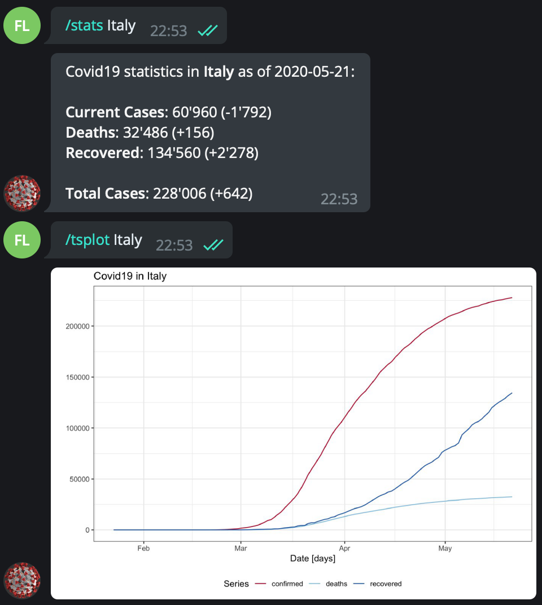
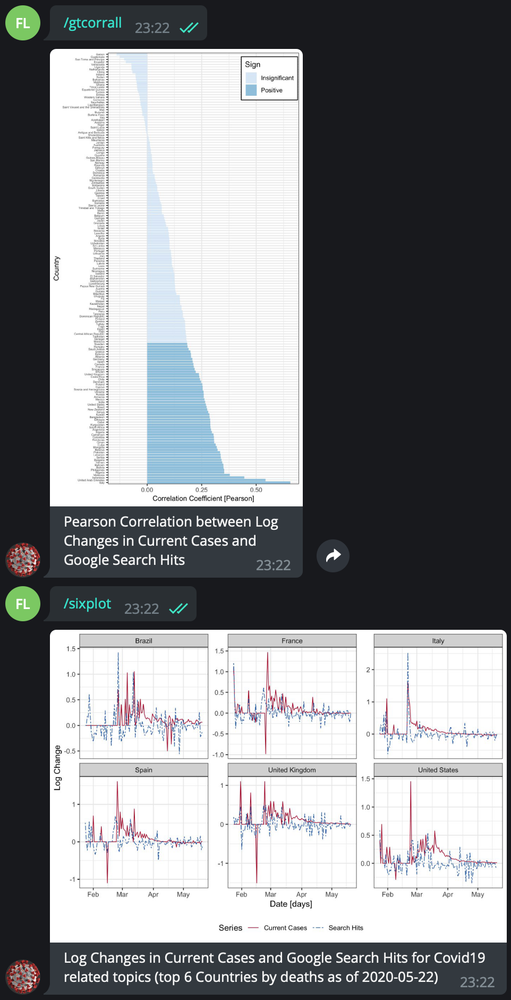
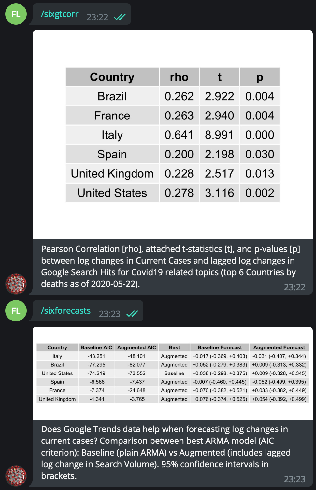

Covid19 & Google Trends Telegram Bot
================
Federico Baldi Lanfranchi
March 22, 2020

# Introduction

The goal of this project is to build and operate a basic (R)Telegram bot
to inform users on changes in Covid19-relevant time series. Namely,
daily time series for current and total cases by country, as well as
deaths and recovered patients are implemented. Covid19 data is fetched
from the CSSEGIS repository, made available by John Hopkins University.

I also include log changes in Google Search Volume for Covid19 as a
proxy for user concern towards the pandemic. In particular, I suggest
such measure may yield marginal predictive power over changes in the
number of infected patients. Google makes available indices of search
volume for individual queries through its product Google Trends. Google
also mantains a number of “topics”, each tracking the aggregate search
volume for a particular set of related keywords. For reference, the
query string for the “Covid19 (Virus)” topic, in URL decoded format, is
/m/01cpyy.

There is a prolific literature on Google Trends data aplications. Jun,
Yoo and Choi (2018) offer a comprehensive review of research
applications involving Google Trends data across various fields. The
present project draws inspiration from the work of Ginsberg et al.
(2009). They show that monitoring Google queries for selected search
terms can improve early detection of influenza-like epidemics.

At the time of writing, 172 countries are supported. R is picked as the
language of choice in light of its support for data science applications
and the Telegram API.

## How to Run

<ol>

<li>

Open the <code>covid19\_gtrends\_telegram.R</code> file and run it. It
is worth mentioning that to collect Google Trends data one must run
individual queries for each country. Such queries must be spaced out to
prevent Google from blocking them, which makes the process time
consuming. Therefore the code file allows to either run the full
download (30min ETA) or to load a(n older) local copy of the data. This
is controlled by the <code>source</code> parameter of the
<code>fbl\_get\_search\_data</code> (<code>o</code> for online source,
<code>l</code> for local source). As a default, local data is used for
the entire set of countries, while online data is retrieved for the
subset of 6 countries most affected in terms of deaths at the time of
writing (Italy, Brazil, United States, Spain, France, and United
Kingdom).

</li>

<li>

While <code>updater$start\_polling()</code> is running, the Telegram bot
is active. To access the bot, visit
<a href="https://t.me/Covid19Gtrendsbot">https://t.me/Covid19Gtrendsbot</a>.
It might be necessary to copy and past the link in a browser window,
since sometimes the wrong bot may be loaded when clicking the link.

</li>

<li>

The following commands may be issued to the bot via the Telegram chat:

<ul>

<li>

`/start` - Initialise and activate the bot

</li>

<li>

`/countrylist` - Output a list of supported countries (case sensitive),
which can be passed as inline arguments to `/stats` and `/tsplot`

</li>

<li>

`/stats` - \[i.e. `/stats United States`\] Given an argument country,
output statistics on current and total cases, deaths and recovered
patients

</li>

<li>

`/tsplot` - \[i.e. `/tsplot United States`\] Given an argument country,
plot total cases, deaths and recovered patients over time

</li>

<li>

`/sixplot` - Plot dynamics in current cases against dynamics in Google
search volume (top 6 countries by deaths)

</li>

<li>

`/sixgtcorr` - Output correlation coefficients between log changes in
current cases and log changes in Google search volume (top 6 countries
by deaths)

</li>

<li>

`/gtcorrall` - Plot correlation coefficients between log changes in
current cases and log changes in Google search volume (all countries)

</li>

<li>

`/sixforecasts` - Does Google Trends data improve forecasting accuracy
wrt relative changes in current cases on the next day? Provide summary
statistics and forecasts (top 6 countries by deaths)

</li>

</ul>

</ol>

## Functionality and some Examples

### Single Country Information

The bot can provide daily updates on the Covid19 time series and plot
the state of the epedemic to date for a given input
country.

In the 6 countries where Covid19 claimed the most victims, relative
changes in search volume seem to align with changes in the number of
active cases and, at times, to anticipate them. In general, the two
measures are significantly positively correlated for many developed
countries.

Relative to the 6 countries above mentioned, a simple ARMA model seems
to benefit from the addition of a search-volume-based regressor, at
least
in-sample.

## Acknowledgements

The bot builds on Covid19 time series downloaded from the
<a href="https://github.com/CSSEGISandData/COVID-19">COVID-19 Data
Repository by the Center for Systems Science and Engineering (CSSE) at
Johns Hopkins University</a>. This project was completed as part of the
requirements for the “Skills: Programming with Advanced Computer
Languages” class, held at the University of St. Gallen in Spring 2020.

### References

<ul>

<li>

Jun, S.-P., Yoo, H. S. and Choi, S. (2018), ‘Ten years of research
change using Google Trends: From the perspective of big data
utilizations and applications’, *Technological Forecasting and Social
Change* **130**, 69–87.

</li>

<li>

Ginsberg, J., Mohebbi, M. H., Patel, R. S., Brammer, L., Smolinski, M.
S. and Brilliant, L. (2009), ‘Detecting influenza epidemics using search
engine query data’, *Nature* **457**(7232), 1012–1014.

</li>

</ul>
